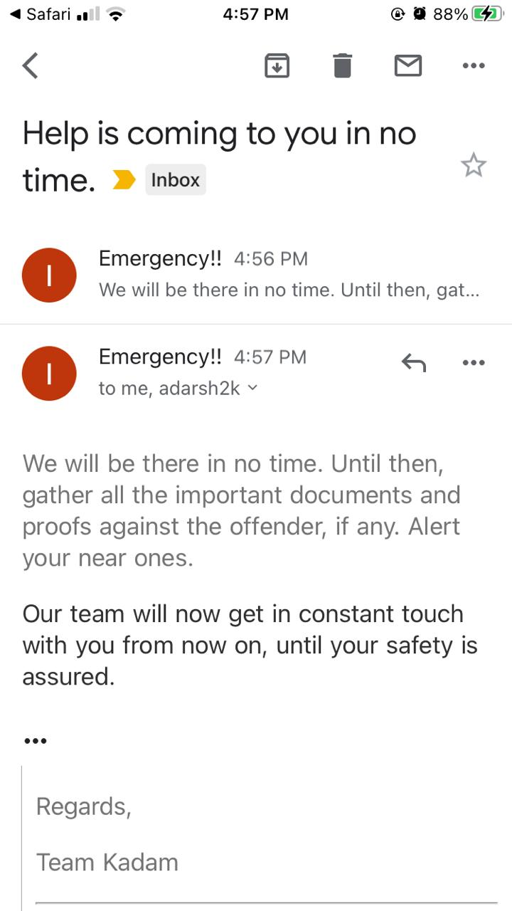

<h1>Project Name-KADAM</h1>
 
<h2>Tagline</h2>

This website is an initiative to help women in every aspect. Ranging from any kind of harassment or abuse to seeking medical help. The name of our website- KADAM means taking step in right direction.

<h2>The Problem it Solves</h2>

It was reported that between March 23 and April 16, the National Commission for Women’s (NCW) Complaint and Investigation Cell registered 587 domestic violence complaints. Between march 23 to April 10 besides the 123 women who complained against domestic violence, 117 complained to the commission seeking help to secure their human rights to live a life of dignity. There have also been 21 complaints related to harassment by married women and dowry.

 

<h2>Challenges we ran into</h2>
<ul>
    <li>We faced challenges in setting up a call with the emergency contact</li>
    <li>Some deployment issues with WebRTC</li>
    <li>As we had less experience with backend so we were unable to add any database for user authentication</li>
    <li>As Google Map API is paid so we ran into some issues with it too.
</li>

</ul>

<h2>How to setup projrct Locally</h2>
<ul>
    <li>First Download the zip folder from github</li>
    <li> Now Extract all the files at one location</li>
    <li>Run the index.html file on your Browser  </li>

    
</ul>

<h5>Link to Project:-https://dev-calm2.pantheonsite.io/news/ </h5>

<h5>Image preview of email sent</h5>
            
      